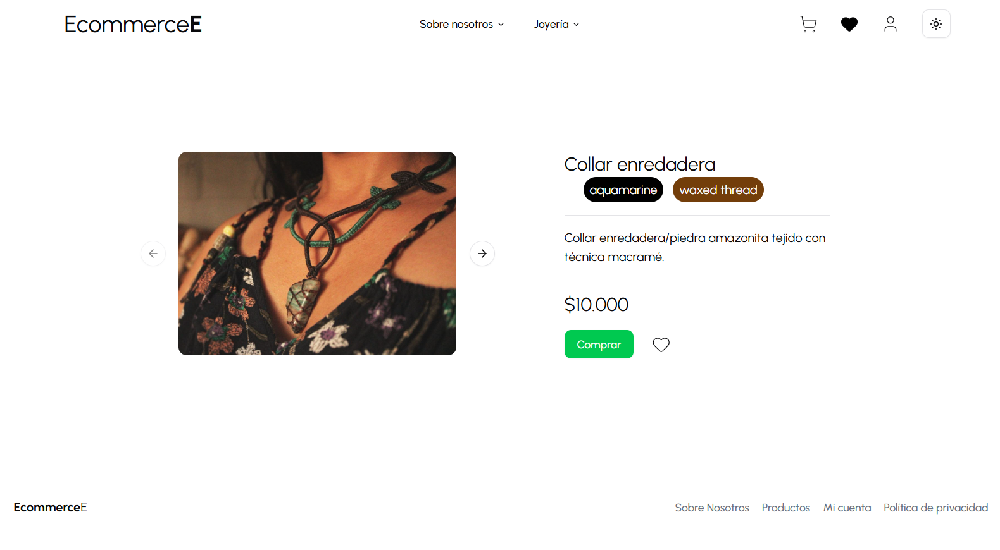
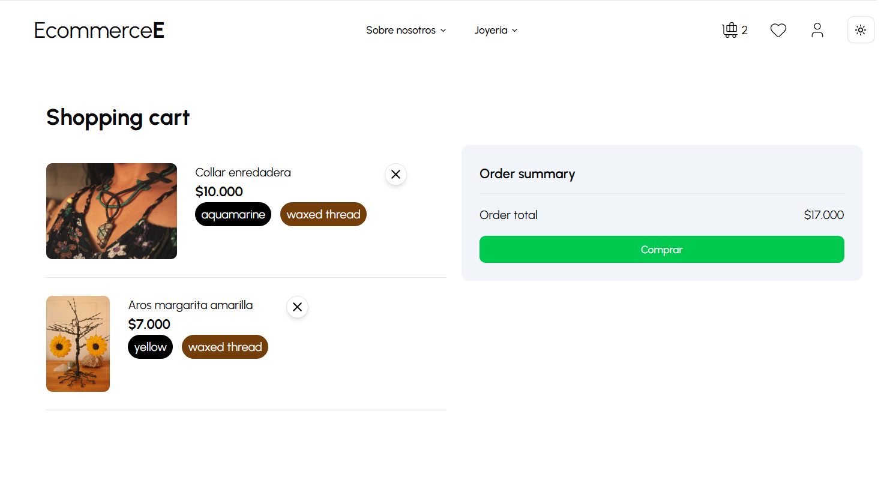
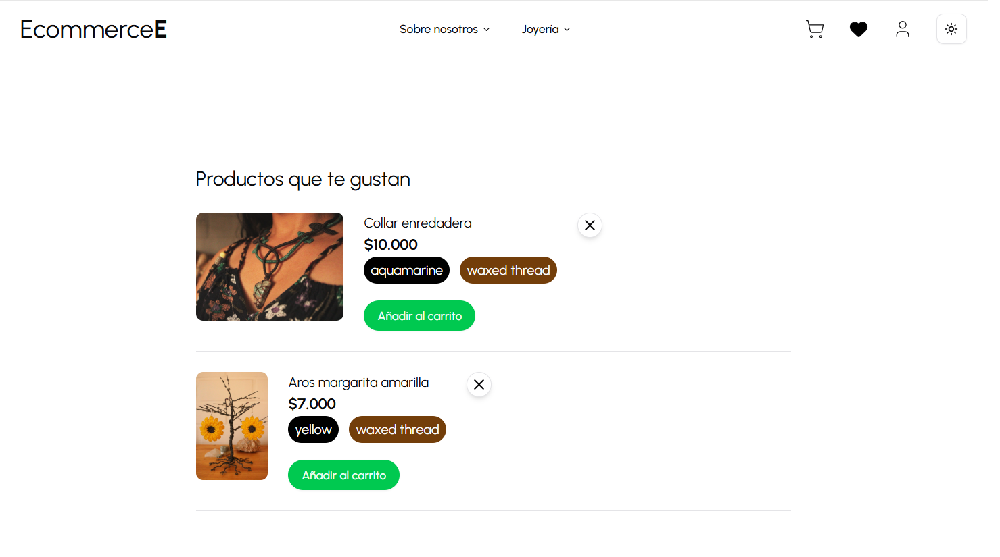
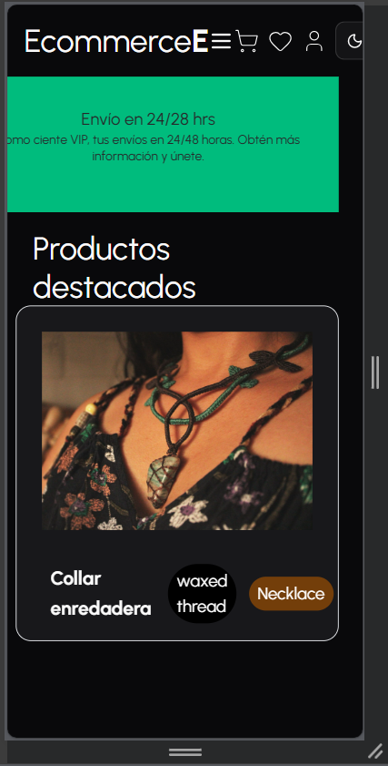

# E-commerce Platform

Full Stack e-commerce application focused on product management and online payments, built as a personal project to practice real-world integrations and service-oriented architecture.

## 🚀 Tech Stack

**Frontend**
- TypeScript
- React
- REST API consumption

**Backend**
- JavaScript
- REST API
- Strapi (Headless CMS)

**Payments**
- Flow.cl API

## ✨ Features

- Product listing and order creation
- Purchase flow integration
- Payment processing via Flow.cl
- Separation between frontend and backend services
- API-based communication with Strapi

## 🧱 Architecture

- Frontend application consumes two REST APIs:
  - Product and order management via Strapi
  - Payment processing via Flow.cl
- Backend services are separated to keep responsibilities clear and scalable

## 🔐 Backend & Security

Backend services (Strapi API and payment integration) are hosted in separate private repositories.

API keys and sensitive configuration are managed using environment variables and are not exposed in this repository.

## 📸 Screenshots

### Home Page
- Featured products
- Categories and promotional banners
- Quick actions: view product details or add to cart

### Product Details
- Detailed product view
- Add to cart
- Add or remove from wishlist

### Shopping Cart
- View selected products
- Remove items from cart
- Proceed to checkout and payment

### Wishlist
- Manage loved products
- Add products directly to cart
- Remove products from wishlist

### UI & Responsiveness
- Fully responsive layout for mobile, tablet, and desktop
- Light and dark mode support

